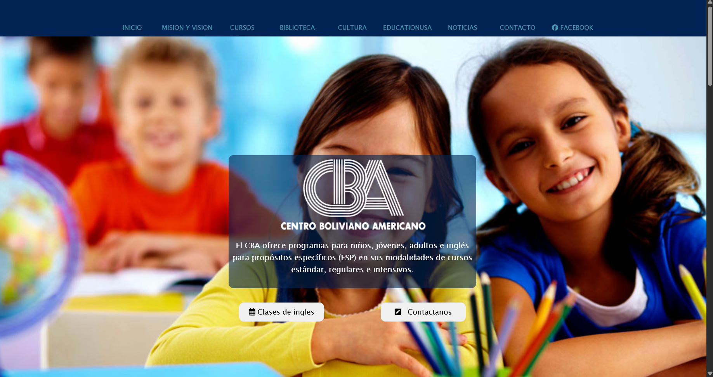

# 🧪 Clon Instituto CBA

Este es un clon de la página principal del **Instituto de Inglés CBA** realizado como práctica personal de maquetado web. El objetivo fue replicar el diseño visual utilizando únicamente **HTML** y **CSS**, sin frameworks ni constructores.

---

## ✨ Objetivos

- Practicar maquetado desde cero a partir de un diseño existente.
- Mejorar habilidades con layout (flexbox/grid), tipografías y estructura semántica.
- Asegurar responsividad básica en dispositivos comunes.

---

## 🧰 Tecnologías utilizadas

- HTML5
- CSS3
- Responsive Design (Media Queries)

---

## 🔍 Vista previa

 <!-- o puedes subir una captura real -->

📺 Puedes ver el sitio aquí: [Demo en línea](https://severnaster.github.io/cba_web_page_clone/)

---

## 🔗 Página original

Este proyecto es un clon de la página oficial del [Instituto CBA](https://www.cba.edu.bo), realizado únicamente con fines educativos y de práctica personal.

> **Nota:** No tengo ninguna relación con el Instituto CBA. El propósito de este proyecto es practicar maquetado web replicando el diseño de una página existente.

## 📄 Licencia

Este proyecto fue realizado con fines educativos. **No está afiliado ni relacionado oficialmente con el Instituto CBA.**
